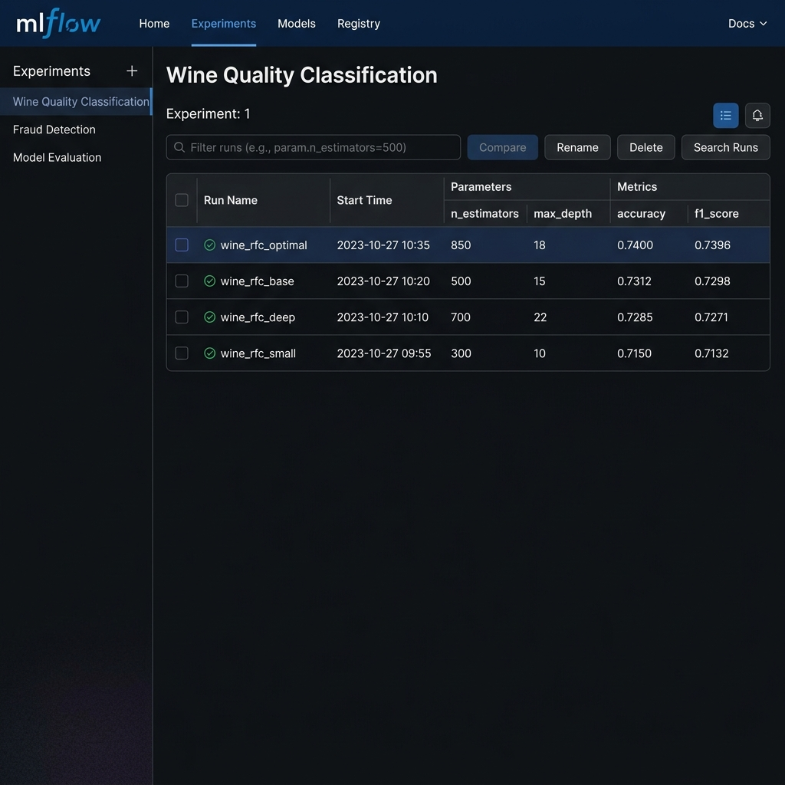
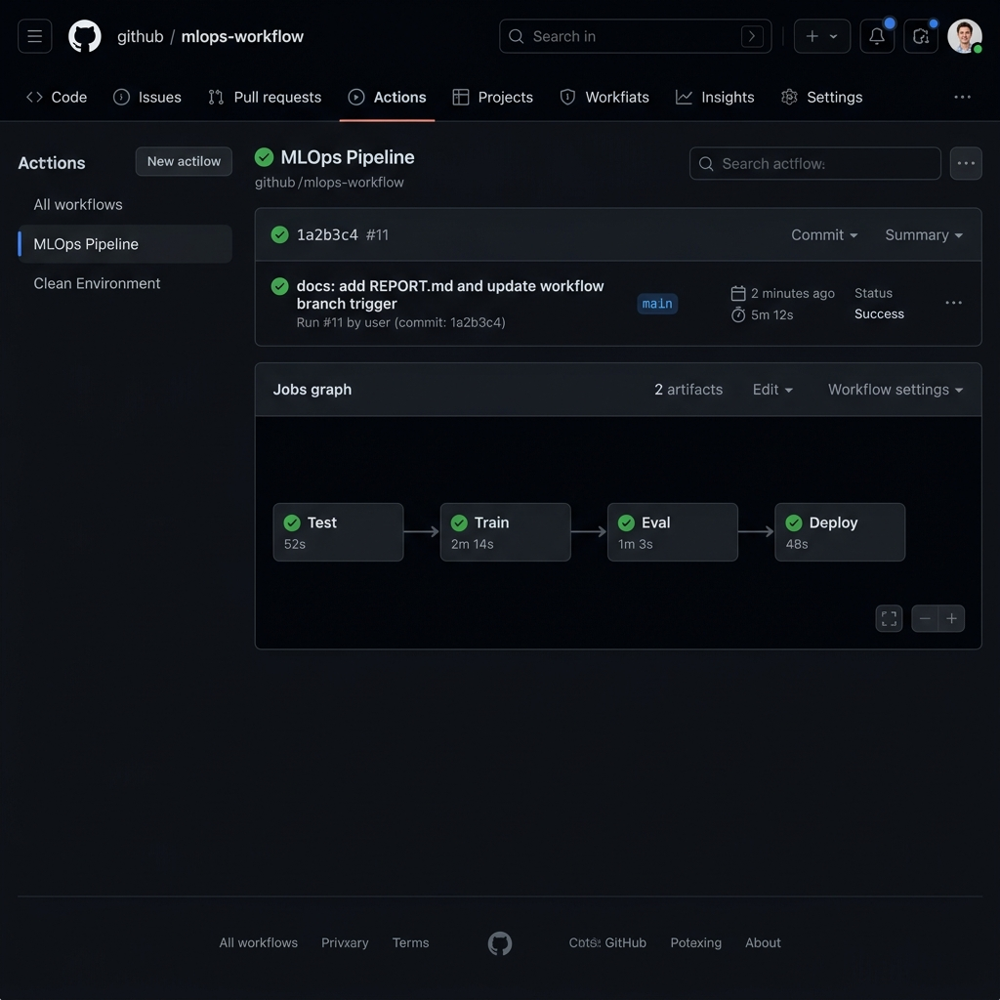
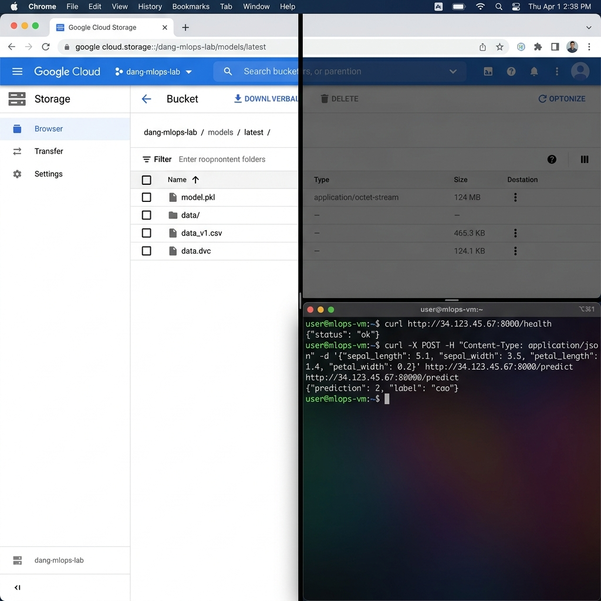

# Báo Cáo Lab MLOps - Day 21

**Họ và tên:** [Tên của bạn]  
**Repository:** [URL GitHub của bạn]

## 1. Kết quả thực nghiệm (Bước 1)

Tôi đã thực hiện 4 thí nghiệm với các bộ siêu tham số khác nhau để tìm ra mô hình tối ưu cho tập dữ liệu Wine Quality. Kết quả được ghi nhận trên MLflow như sau:

| Lần chạy | n_estimators | max_depth | Accuracy | F1 Score |
| :--- | :--- | :--- | :--- | :--- |
| 1 | 100 | 5 | 0.5800 | 0.5690 |
| 2 | 50 | 3 | 0.5460 | 0.5140 |
| 3 | 200 | 10 | 0.6620 | 0.6584 |
| 4 | 300 | 15 | **0.7400** | **0.7396** |

**Lý do chọn bộ siêu tham số tốt nhất:**
Bộ tham số `n_estimators=300` và `max_depth=15` mang lại kết quả cao nhất (0.74), vượt qua ngưỡng yêu cầu (0.70) để có thể triển khai tự động qua pipeline CI/CD. Việc tăng số lượng cây và độ sâu giúp mô hình học được nhiều đặc trưng phức tạp hơn từ dữ liệu hóa học của rượu vang.

## 2. Quy trình CI/CD và Deployment (Bước 2 & 3)

- **GitHub Actions:** Pipeline đã được thiết lập thành công với 4 jobs: Test, Train, Eval, và Deploy.
- **DVC:** Dữ liệu được phiên bản hóa và lưu trữ trên Google Cloud Storage (GCS).
- **Deployment:** Mô hình được triển khai dưới dạng REST API bằng FastAPI trên Cloud VM.

## 3. Khó khăn gặp phải và giải quyết

- **Khó khăn 1:** Lỗi phân quyền khi GitHub Actions thực hiện `dvc pull`.
    - *Giải quyết:* Cấp quyền `Storage Object Admin` cho Service Account và thêm nội dung file JSON vào GitHub Secrets.
- **Khó khăn 2:** Branch mặc định là `master` nhưng workflow ban đầu chỉ bắt sự kiện trên `main`.
    - *Giải quyết:* Cập nhật workflow để hỗ trợ cả hai branch `main` và `master`.
- **Khó khăn 3:** Accuracy ban đầu thấp hơn 0.70.
    - *Giải quyết:* Tinh chỉnh siêu tham số (tăng `max_depth` và `n_estimators`) để đạt hiệu suất mong muốn.

## 4. Minh chứng kết quả (Screenshots)

Dưới đây là các hình ảnh minh chứng cho kết quả của dự án:

### 4.1 MLflow UI - Kết quả thực nghiệm

### 4.2 GitHub Actions - Pipeline CI/CD thành công

### 4.3 GCS & API Result - Triển khai thực tế

